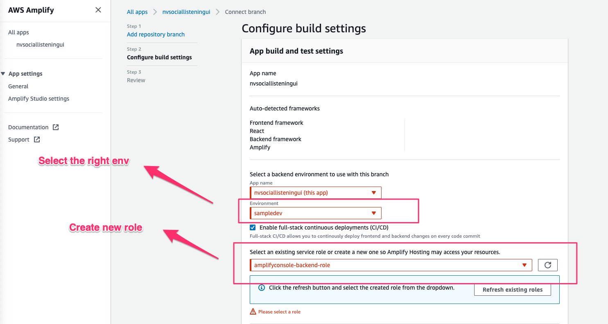
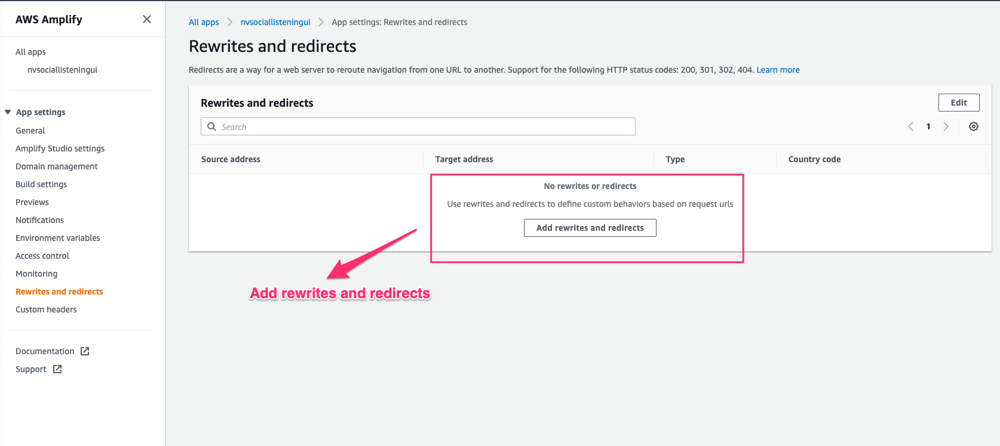
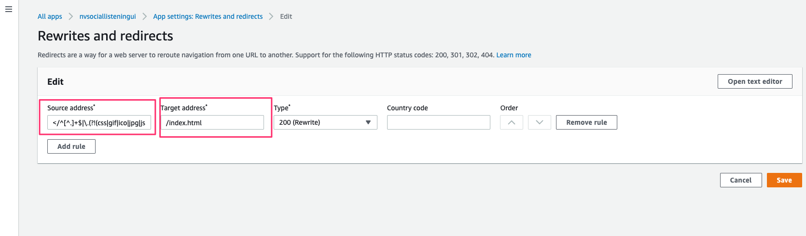

# Getting Started 

To run locally

```
> npm run start

open https://localhost:3000
```


To test lambda function
```
> cd amplify/backend/function/nvsocialsettingslambda/src

// List out all the test events
> cat package.json | jq ".scripts"  

//Run test
> npm run test:getRecentMentions
```


# Setting up in the same account (i.e. collaboration)

```
# Clone repo
> git clone https://github.com/sebastianlzy/nv-social-listening-ui

# Setup amplify to sync with upstream changes
> amplify init
```

# Setting up in new AWS account (Optional)

```
# Remove any existing configuration
> rm ./amplify/team-provider-info.json

# Remove AWS profile
> vim ./amplify/.config/local-aws-info.json
```

# Create backend
```
> amplify init --app https://github.com/sebastianlzy/social-listening-ui
```


# Re-provision hosting
```
> amplify add hosting

? Select the plugin module to execute Hosting with Amplify Console (Managed hosting with custom domains, Continuous deployment)
? Choose a type Continuous deployment (Git-based deployments)

//unfortunately, the connection to the github repo will still need to be done using the AWS console. 
// Follow the instruction to connect to your chosen version control
```



# Setup rewrites and redirect

<details>
  <summary>Using AWS CLI</summary>

   ```
    > export APP_ID=$(aws amplify list-apps --query 'apps[?name==`nvsociallisteningui`].appId' --output text)
    > echo '[{"source": "</^[^.]+$|\\\.(?!(css|gif|ico|jpg|js|png|txt|svg|woff|woff2|ttf|map|json)$)([^.]+$)/>","target": "/index.html","status": "200"}]' > custom-rules.json 
    > aws amplify update-app --app-id $APP_ID --custom-rules file://custom-rules.json
   
   ```
</details>

<details>
  <summary>Using AWS Console</summary>



```
Source address: </^[^.]+$|\.(?!(css|gif|ico|jpg|js|png|txt|svg|woff|woff2|ttf|map|json)$)([^.]+$)/>
Target address: /index.html
Type: 200(Rewrite)
```



</details>

